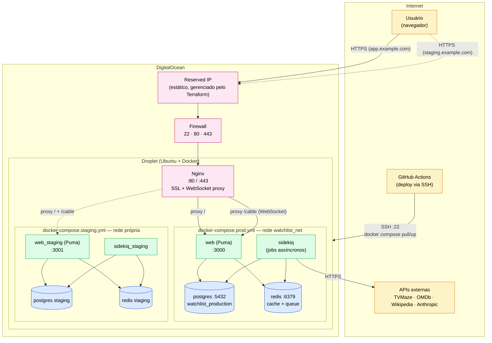
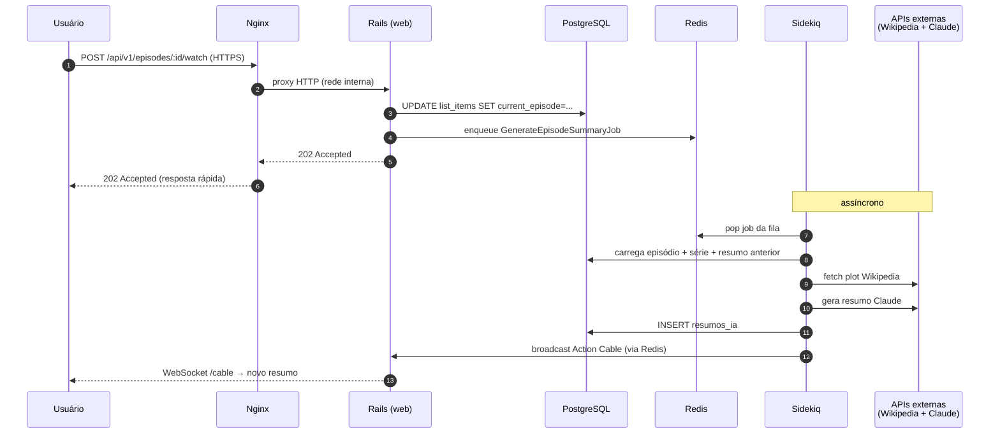
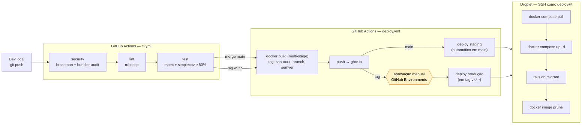

# Diagrama de Deployment — WatchlistTracker

> Visão formal de **o que roda onde** em produção, **como uma requisição flui** e **como o código chega ao servidor**. Complementa `infraestrutura_conceitos.md` (que explica o porquê de cada peça).

---

## 1. Topologia de produção

Tudo roda em **um único Droplet** na DigitalOcean (Fase 1). Produção e staging compartilham a máquina mas têm DBs e portas separadas.

### O que está em cada peça

| Componente | Imagem / origem | Função | Exposto à internet? |
|---|---|---|---|
| Reserved IP | Terraform (`modules/networking`) | IP estático para o DNS apontar | Sim (entry point) |
| Firewall | Terraform (`modules/server`) | Libera apenas 22/80/443 entrada; saída livre | — |
| Nginx | Instalado no host (não containerizado) | TLS, roteamento por `server_name`, upgrade WebSocket | Sim (80/443) |
| `web` | `ghcr.io/.../backend:tag` (Rails) | Puma servindo API JSON | Não (acessível só via Nginx) |
| `sidekiq` | Mesma imagem do `web` | Workers de jobs (IA, e-mails) | Não |
| `postgres` | `postgres:16-alpine` | Banco relacional | Não (rede interna Docker) |
| `redis` | `redis:7-alpine` | Cache + fila do Sidekiq | Não (rede interna Docker) |
| Stack staging | `docker-compose.staging.yml` | Mesma topologia, DB e porta separados | Não diretamente |

**Princípio:** só Nginx fala com o mundo externo na entrada. Banco e Redis vivem na rede `watchlist_net` do Docker — invisíveis fora do Droplet.

---

## 2. Fluxo de uma requisição (caminho feliz)

Exemplo: usuário marca um episódio como assistido e dispara geração de resumo IA.

**Pontos a notar:**
- A resposta HTTP volta em ~50ms — geração de IA não bloqueia a request.
- Redis tem dois papéis: fila de jobs (Sidekiq) e pub/sub do Action Cable.
- O WebSocket `/cable` foi aberto antes pelo cliente; o broadcast só notifica.

---

## 3. Fluxo de deploy (do commit ao servidor)

**Regras importantes:**
- Push em `main` → vai pra staging sozinho.
- Promover pra produção exige **criar uma tag** `v*.*.*` E **aprovar** no GitHub (Environment `production` com reviewers obrigatórios).
- Migrations rodam **após** o `up -d` — Rails 8 aguenta um instante de mismatch durante o swap dos containers; mudanças incompatíveis (drop de coluna) exigem deploy em duas fases (futuro).

---

## 4. Quando esse diagrama muda

Atualize este arquivo se:
- Separar Postgres em Droplet/serviço gerenciado próprio.
- Adicionar um segundo Droplet (load balancer entra em cena).
- Migrar Nginx para dentro de container.
- Adicionar CDN / object storage para uploads.
- Mudar de Sidekiq para outra fila.

O diagrama é fonte de verdade da **topologia atual**, não de planos futuros.
